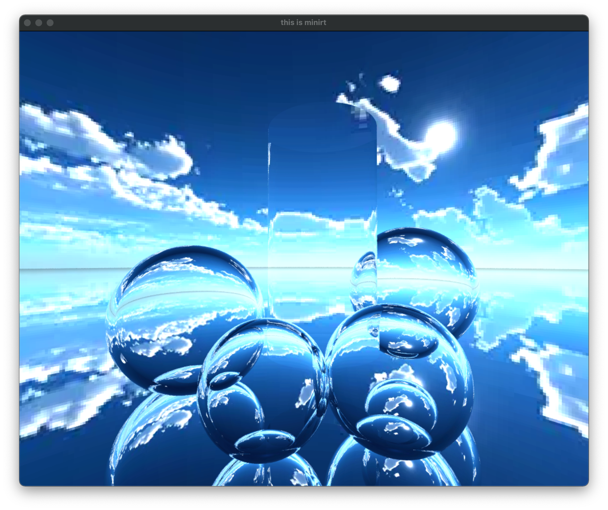
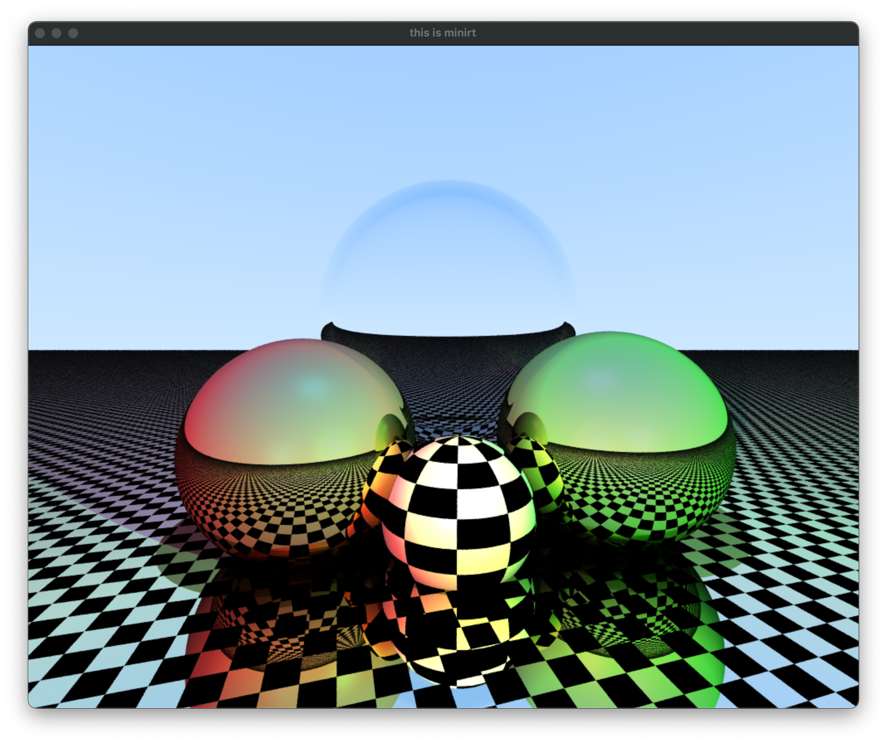
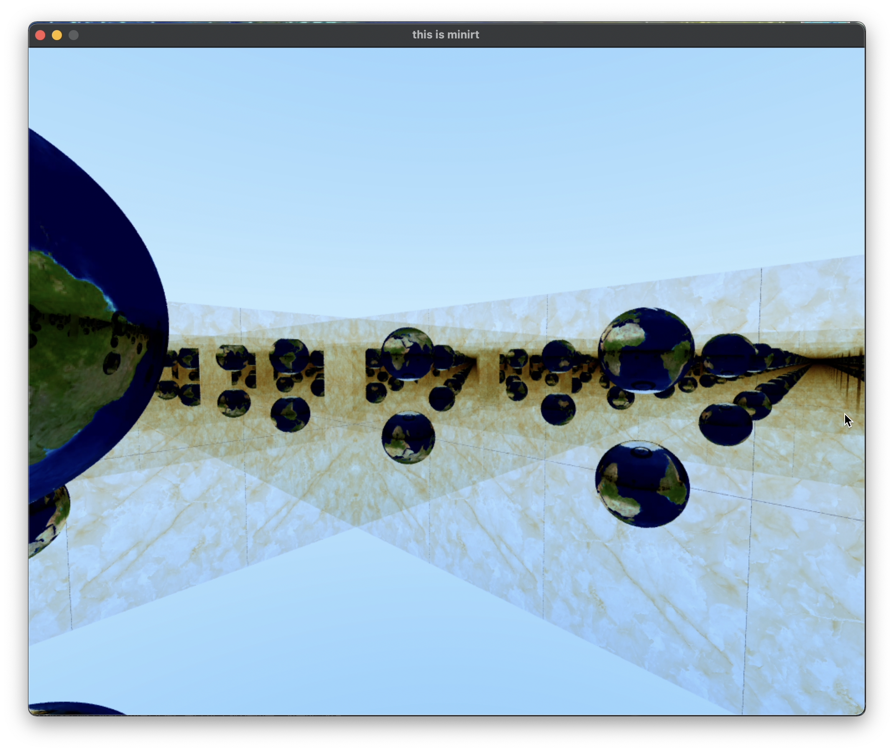
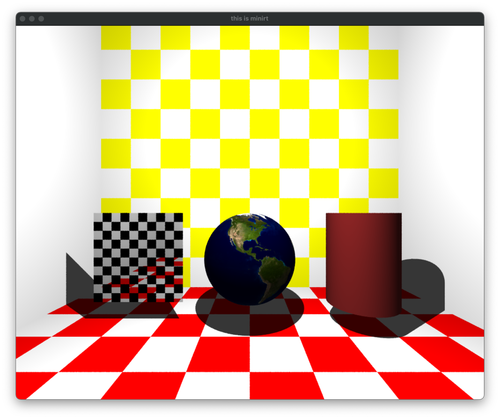

# Mini Ray Tracing

My mini ray tracer is a simple ray tracer that can be used to render simple scenes.

## Features

* Ray Tracing with Shaders
* Anti-aliasing
* Textures (+ Checkerboard)
* Phong Shading (+ Shadows)
* Materials
    * lambertian
    * dielectric (Refraction)
    * metal (Reflection)







## Usage
### Build

> Only works on MacOS

```bash
brew install zlib
make
./minirt maps/metal-balls.rt
```

### Key Bindings

* WASD,Space,Shift - camera movement
* Mouse L/R - camera rotation, object rotation
* L - toggle light
* M - toggle scatter mode
* T - toggle texture
* R - toggle resolution
* C - toggle camera
* G - toggle GUI
* P - save to `out.rt` file
* +- - increase/decrease anti-aliasing

### Configuration

you can change the default configuration in the `Makefile`

* H_THREAD - number of threads for height (default 5)
* W_THREAD - number of threads for width (default 5)
* LOWER_RESOLUTION - number to lower the resolution (default 3)
* MAX_DEPTH - maximum depth for raytracing (default 50)

## RT file format
### Scene

| Type | Foramt | Example | Description |
| ---- | ------ | ------- | ----------- |
| Resolution | `R <width> <height>` | `R 800 600` | Can only be declared once |
| Ambient Light | `A <ratio> <r>,<g>,<b>` | `A 0.1 255,255,255` | Can only be declared once |
| Camera | `c <x>,<y>,<z> <rx>,<ry>,<rz> <fov>` | `c 0,0,0 0,0,1 80` | |
| Light | `l <x>,<y>,<z> <ratio> <r>,<g>,<b>` | `l 0,0,0 0.1 255,255,255` | |

### Objects

> nx,ny,nz is the normal vector

| Type | Foramt | Example |
| ---- | ------ | ------- |
| Plane | `pl <x>,<y>,<z> <nx>,<ny>,<nz> <r>,<g>,<b>` | `pl 0,0,0 0,1,0 255,255,255` |
| Sphere | `sp <x>,<y>,<z> <r> <r>,<g>,<b>` | `sp 0,0,0 2 255,255,255` |
| Triangle | `tr <x1>,<y1>,<z1> <x2>,<y2>,<z2> <x3>,<y3>,<z3> <r>,<g>,<b>` | `tr 0,0,0 1,0,0 0,0,1 255,255,255` |
| Square | `sq <x>,<y>,<z> <nx>,<ny>,<nz> <side> <r>,<g>,<b>` | `sq 0,0,0 0,1,0 2 255,255,255` |
| Cylinder | `cy <x>,<y>,<z> <nx>,<ny>,<nz> <r> <h> <r>,<g>,<b>` | `cy 0,0,0 0,0,1 2 4 255,255,255` |

### Materials

| Type | Foramt | Example | Description |
| ---- | ------ | ------- | ----------- |
| Lambertian | `<obj>-lambertian ... ` | `sp-lambertian 0,0,0 1 255,255,255` | |
| Metal | `<obj>-metal ... <fuzz>` | `sp-metal 0,0,0 1 255,255,255 0` | 0 becomes like a mirror |
| Dielectric | `<obj>-dielectric ... <ir>` | `sp-dielectric 0,0,0 1 255,255,255 0.9` | |

### Textures

> specified at the end of the line (atfer material)

| Type | Foramt | Example | Description |
| ---- | ------ | ------- | ----------- |
| Checkerboard | `... checkerboard` | `sp 0,0,0 1 0,0,0 checkerboard` |  The color is made up of a given color and black |
| Image | `... <path>` | `sp 0,0,0 1 0,0,0 res/earth.png` | Only `*.png` file available |

**Note**: dielectric are not supported for textures

## TODO

* Caustics
* FPS counter

## Reference

https://raytracing.github.io/books/RayTracingInOneWeekend.html
